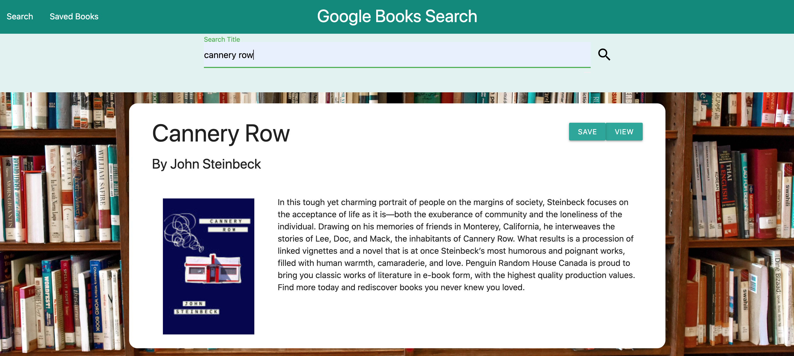

[](https://www.gnu.org/licenses/gpl-3.0)
  # Google Books Search

  

  ## Table of Contents
  * [Description](#description)
  * [Installation](#installation)
  * [Usage](#usage)
  * [Contributing](#contributing)
  * [Tests](#tests)
  * [Questions](#questions)
  * [License](#license)

  ## Description
  This project ia a MERN stack website based around the Google books API. On the main page a user can search books by title and the results are displayed on the page. The user is presented with two options to either save or view books. The save option sends the book information to the server where it is stored in a Mongo database. The view option links the user to the google books page for that particular book. The saved books page pulls all the books saved in the database and renders them on the screen. React router is used to link these two pages. In addition to the graphical display an API access point is available to retrieve the book data in JSON format.
  ## Installation
  ```npm i``` will install all the necessary dependencies from the package.json.
  ## Usage
  The API endpoint '/api/books' is available as a GET route to retrieve all books in JSON format. The data structure is as follows:
  ```JSON
  [
    {
      "authors": [
        "array of authors"
      ],
      "_id": "unique id",
      "title": "title of book",
      "description": "description of book",
      "image": "thumbnail image link",
      "canonicalVolumeLink": "link to google book page",
    }
  ]

  ```
  The following is a link to the website: 
  
  [Google Book Search](https://joseph-books-search.herokuapp.com/)
  ## Contributing
  The front/back end is built on a MERN stack. React Router enables route navigation and Axios enables API calls. Special thanks to the Google Books API and the Materialize css framework.
  ## Tests
  N/A
  ## Questions
  Github profile: [dgtlctzn](https://github.com/dgtlctzn)
  
  If you have any questions about the project please contact josephperry720@gmail.com
  ## License
  This project is covered under the GNU license
